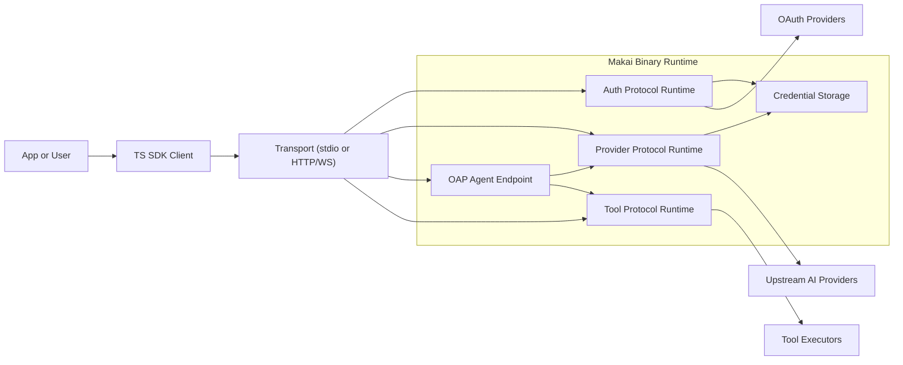
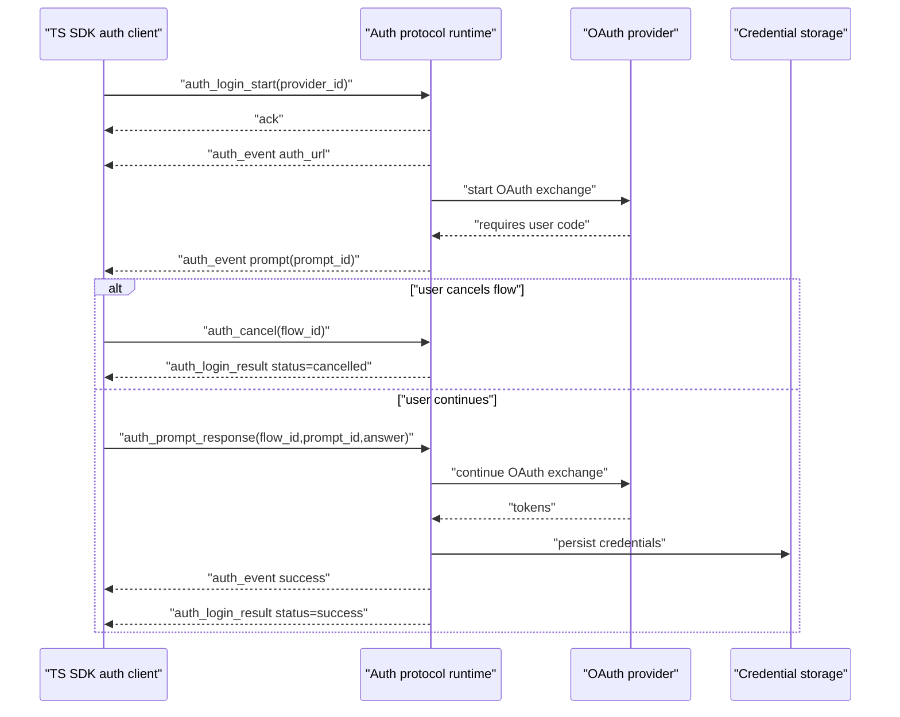
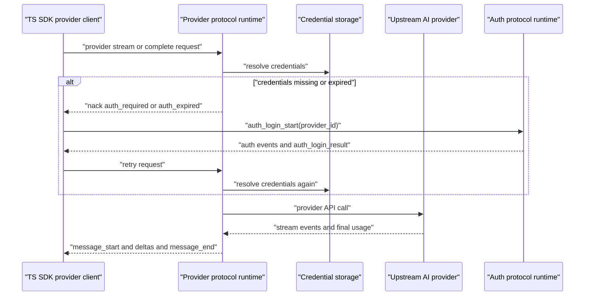
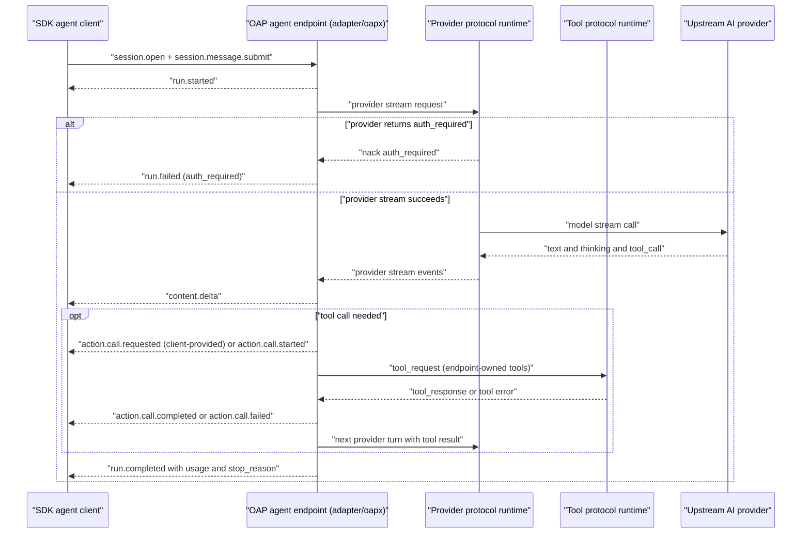
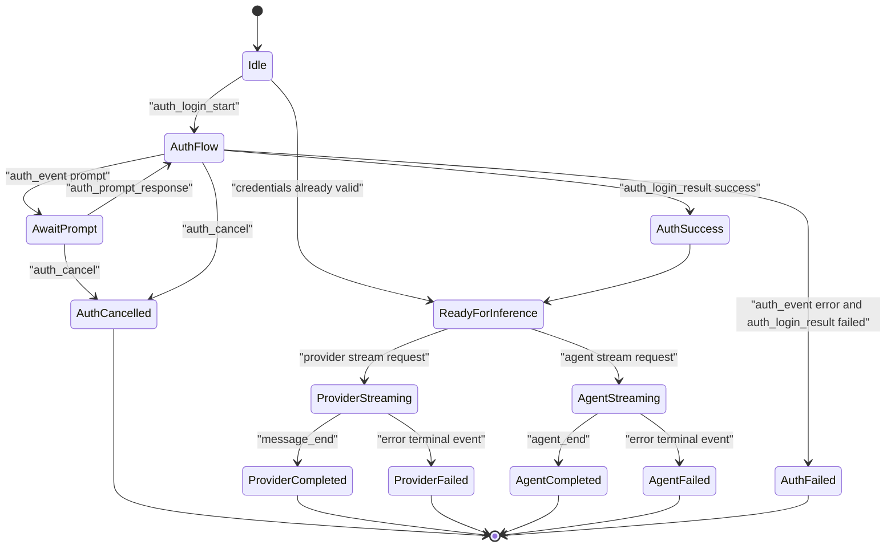
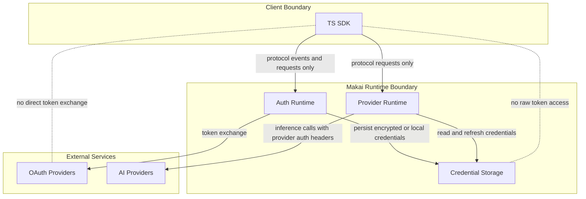

# Makai Design (Single Source of Truth)

Status: authoritative
Scope: architecture, protocol boundaries, ownership model, sequencing, transport posture, testing posture

## 1) Purpose

Makai is a Zig-first streaming AI runtime with:
- distributed auth protocol,
- multi-provider streaming abstraction,
- distributed provider protocol,
- an OAP agent-control endpoint (`oapx serve agent`),
- distributed tool protocol,
- agent loop + tool execution bridge,
- pluggable transports.

This document is the canonical design reference for the repository.

---

## 2) Core Architecture

Makai is organized into four runtime layers:

1. **Streaming Core**
   - provider-agnostic event types and stream plumbing
   - lock-free `EventStream`
   - core data model (`ai_types`) and utility modules

2. **Provider Layer**
   - implementations for Anthropic/OpenAI/Google/Azure/Ollama/etc.
   - provider credential resolution/refresh and provider-specific request/response translation

3. **Protocol Layer**
   - **auth protocol** (`protocol/auth/*`)
   - **provider protocol** (`protocol/provider/*`)
   - **tool protocol** (`protocol/tool/*`)
   - envelope serialization, sequence validation, client/server handlers
   - the agent boundary is OAP agent-control-core, served by `adapter/oapx` through
     `oapx serve agent`; the Makai v1 agent protocol (`protocol/agent/*`) and the bare
     `oapx --stdio` host are retired (#376), and every SDK speaks OAP to
     `oapx serve agent,provider --stdio`. The auth and provider protocols above stay as
     internal boundaries: the OAP auth adapter and the in-process provider bridge use them.

4. **Agent Layer**
   - agent loop
   - tool execution orchestration
   - direct provider mode or provider-protocol mode via bridge/runtime

Design boundary:
- Agent layer is auth-agnostic.
- Auth protocol/runtime owns interactive OAuth flows + credential persistence.
- Provider layer owns request-time credential consumption/refresh for model calls.

---

## 3) Runtime Placement Clarification

`runtime.zig` modules are **pump/orchestration runtimes**, not protocol definitions.

- `protocol/provider/runtime.zig`
  - pumps client->server messages
  - forwards provider stream events/results/errors server->client
  - used in production integration paths (not test-only)

- `protocol/auth/runtime.zig`
  - pumps auth protocol client/server messages
  - routes interactive auth flow events (`auth_url`, `prompt`, `progress`, terminal result)
  - used for SDK auth APIs and CLI wrapper mode

These runtimes are typically hosted on the **server side** of each protocol boundary. In-process setups may host both sides in one process, but ownership is still logically client/server.

---

## 4) Sequencing Model (Normative)

### 4.1 Scope
Sequence is **per session/stream**, never global across all sessions.

ID formats are normative:
- `session_id`: 21-character alphanumeric NanoID (`[A-Za-z0-9]{21}`).
- `message_id`, `stream_id`, and `flow_id`: 26-character Crockford's Base32 ULID (`[0-9A-HJKMNP-TV-Z]{26}`), serialized uppercase and treated as opaque.

Sequence scopes:
- Provider protocol: sequence scope = ULID `stream_id`
- Auth protocol:
  - standalone query scope = envelope ULID `stream_id` (for example `auth_providers_request`)
  - interactive login scope = ULID `flow_id` (`auth_login_start` -> `auth_event` -> `auth_login_result`)
- Agent boundary: OAP agent-control-core, whose run events carry a per-run `sequence`
  (`drafts/agent-control-core.md`); the v1 per-session agent sequence is retired

### 4.2 Rules
For each session/stream independently:
- first inbound request sequence = `1`
- monotonic increment by exactly `+1`
- duplicates and gaps are invalid
- concurrent sessions maintain independent counters

### 4.3 Implication
Client implementations must maintain a sequence counter map keyed by session/stream ID. A single global sequence counter is non-conformant.

---

## 5) Multiplexing Model (Normative)

Auth and provider protocols, and the OAP agent endpoint, are designed for multi-session multiplexing:
- multiple active auth flows concurrently
- multiple active provider streams concurrently
- multiple active agent sessions concurrently
- envelopes interleaved by transport
- ordering guaranteed only within a session/stream, not globally

Implementation objective:
- auth and provider clients/servers and the OAP agent endpoint must support true concurrent multiplexing.

### 5.1 Provider protocol client lifecycle API (normative usage)

For multiplexed provider streams, callers should use per-stream APIs explicitly:

1. `startStream(...)` -> keep returned `stream_id`
2. `getEventStreamFor(stream_id)` -> consume events for only that stream
3. `waitResultFor(stream_id, timeout_ms)` / `getLastErrorFor(stream_id)` -> terminal query
4. `closeStream(stream_id)` when terminating locally
5. `removeStreamState(stream_id)` after terminal consumption to release per-stream state

Step 3 returns a result the caller owns (`ai_types.OwnedMessage`, a deep copy),
so step 5 may free the client's stored copy without invalidating what step 3
handed back. That ordering is the contract: consume the owned result on any
schedule, and the terminal query never returns a borrowed view of client state.

This lifecycle keeps stream state isolated and prevents long-lived client state growth.

---

## 6) Memory Ownership Model (Critical)

A generic `EventStream` is borrowed by default: what it stores is whatever the
pusher handed it, and `deinit()` frees nothing from an event unless the stream
was built with owned-event cleanup. That default is what makes the generic
container cheap, and it is why a borrowed stream ties every event's lifetime to
the pusher's.

**The provider modules are the exception, and unconditionally so.** Every stream
built by `zig/src/providers/` — anthropic, google, ollama, azure,
openai_completions, openai_responses, azure_openai_responses — and the mock
streams the provider-protocol bridge builds itself clone each event as they queue
it. The rule:

> A provider stream clones every event it queues, so whatever the producing
> thread hands the queue is copied and the producing thread may free its own copy
> the moment the push returns. Nothing a consumer reads is tied to the lifetime of
> the thread that produced it.

This was chosen over per-event ownership because a producer thread cannot
outlive-correct the events it has queued: `wait()` reads the ring buffer before it
checks `completed`, and `deinit()` drains through `poll()` after joining the
thread, so an event can reach a consumer *after* every buffer the thread owned has
been freed. Retiring those buffers in a thread-scoped list is a use-after-free, not
a lifetime. The cost is a deep copy per event, on every provider stream and for
every caller, and it is paid deliberately to remove the class rather than one
instance of it.

Consequences, all of which the ownership tests check:

1. A consumer of a provider stream **must** release each event it polls
   (`releaseEvent`, or `deinitAssistantMessageEvent`), because the clone is
   per-poll. A consumer that keeps an event and never releases it leaks.
   The TUI fixture provider (`zig/src/tui/fixture_provider.zig`) is owned too: it
   pushes a terminal event alongside `stream.complete()`, and because those are two
   separately allocated messages, the event clone and the stream result are released
   once each. Not every stream in the tree is covered, and a consumer still has to
   branch on `stream.ownership.isOwned()`: the mock streams in the tests of
   `zig/src/session/runtime.zig` and `zig/src/adapter/oapx/local_loop.zig` are not
   built by a provider module and are borrowed,
   so the rule above does not reach it.
2. `StreamOptions.requires_owned_stream_events` **has been removed** rather than
   left inert. It used to let a caller choose the borrowed mode, and a
   caller-chosen ownership flag is what made the two lifetime models coexist in
   one codebase.
3. The terminal is not an event. `done` is delivered as the stream's *result*,
   never pushed onto the queue, so the result cannot be freed both as a queued
   event and as the stream's result. `deinit()` frees it once.
4. Never add blanket event-string deinit in generic `EventStream.deinit()`; that
   would double-free the borrowed events a non-provider pusher may still own.
5. A value handed to a caller across a lifetime boundary is owned by that caller
   or it is not handed over. The provider protocol client's terminal query
   returns `ai_types.OwnedMessage` for this reason: a bare `AssistantMessage`
   carries no ownership in its type, so a caller cannot tell a copy from a view
   of state the client frees on its own schedule.

This ownership model is non-optional and must be preserved in future refactors.

---

## 7) Tool Protocol Design

Tooling is modeled as a first-class distributed protocol concern.

### 7.1 Goals
- allow agent-loop tool execution to run local or remote
- support security isolation by running tools on different machines/processes
- keep request/response and event streaming consistent with existing protocol style

### 7.2 Required message capabilities
At minimum:
- `tool_request` (agent -> tool executor)
- `tool_response` (tool executor -> agent)
- optional streaming tool events for long-running tools:
  - `tool_execution_start`
  - `tool_execution_update` (stdout/stderr/progress)
  - `tool_execution_end`

### 7.3 Correlation + sequencing
- all tool messages are correlated via tool call id + session id
- sequencing remains per session
- tool events can be interleaved across tool calls, ordered per call/session

### 7.4 Failure model
- explicit tool error payloads (typed code + message)
- timeout/cancel support
- deterministic terminal event per tool execution

---

## 8) Transport Posture

### 8.1 Current
- in-process transport: core path for local/protocol integration
- stdio transport: supported
- websocket transport: functional but requires hardening + expanded test depth
- auth/provider/agent/tool protocols must share the same transport posture and semantics

### 8.2 Direction
- increase websocket test rigor (framing, backpressure, reconnects, malformed frames, ordering)
- evaluate Bun-inspired lower-level networking approach (C/C++ interop) where it materially improves websocket robustness/perf
- keep transport interfaces stable (`Sender/Receiver`, async sender/receiver abstraction)

### 8.3 Low-level socket/C-C++ interop options (Batch G note)

1. **Option A (default): pure Zig + Zig 0.16 `std.Io` networking**
   - continue improving current websocket transport and tests
   - lowest integration risk and simplest ownership model
   - Makai does not currently depend on `libxev`; any future event-loop backend must pass the objective gate below before adoption

2. **Option B: hybrid C socket engine + Zig protocol/runtime**
   - wrap battle-tested C/C++ socket stack (for example uSockets/libuv-family)
   - keep Makai protocol/agent/tool layers in Zig
   - highest potential perf upside, highest build/debug complexity

3. **Option C: focused interop slices only**
   - keep websocket state machine in Zig, offload narrow hot paths
   - examples: parser/TLS or socket poll primitives only
   - medium complexity, medium upside

Evaluation rule: stay on Option A unless the objective gate in 8.5 passes.

### 8.4 Objective benchmark + reliability criteria

A candidate interop path must be measured against current websocket transport on
the same host class and workload profile.

Required reliability thresholds (hard gate):
- crash_count = 0
- leak_count = 0
- ordering_violations = 0
- backpressure_failures = 0
- reconnect_success_rate >= 99.9%

Required performance thresholds (at least one):
- p99_latency_ms <= baseline * 0.80, **or**
- throughput_msgs_per_sec >= baseline * 1.25

### 8.5 Minimal POC decision gate (go/no-go)

- Collect baseline + candidate metrics JSON with the fields above.
- Run `./scripts/websocket-poc-gate.sh <metrics.json>`.
- **GO** only when all reliability thresholds pass and at least one performance
  threshold passes; otherwise **NO-GO**.
- Default decision without complete metrics is **NO-GO**.

---

### 8.6 The hub's loop (normative)

A multi-session hub has **one** thread, and it owns the hub's state outright:
entries, journals, cursors, subscribers, holds and the fan-out. It is the only
thread that touches any of them, so a lock never appears in the hub and the
sequencing rules in §4 hold by construction rather than by lock discipline.

One exception, which keeps that rule: a harness's own session list or
transcript (`work.list` with `include_native`, `work.read` of a native
session) is a call into the harness that the loop cannot wait on and that can
take seconds. It runs on a **job thread** that touches none of the hub's
state. The loop resolves what to ask before starting it, the job calls only
the adapter's `native_list` or `native_read` into its own arena, and the loop
composes and sends the answer once the job reports done; a job whose caller
left is dropped by the loop when it finishes. The one lock this adds is
inside an adapter whose native calls share a process (Codex's reader), and it
never blocks: a call that finds it held starts a process of its own.

That thread runs **one** loop, and it waits on the readiest of everything it owns
rather than on each thing in turn:

- every open session's child output,
- the transport's own inputs — the host's request stream on stdio, every
  connection's read side on HTTP and websocket,
- and its own bounded-output queues, when an output is waiting for room.

A wait is on **readiness**, not on a duration. An idle session contributes
nothing to a cycle's latency, and a child that has gone silent holds back
nothing: the loop is not in a blocking read on it while another session has
something to say. A bounded wait is what a cycle falls back on, never what it
plans around.

Rejected, and why:

- **A thread per connection with the hub behind a lock.** The hub's fan-out
  order, its cursor rule and its settle order are specified as sequential
  per session. Under a lock they hold only if every path takes the lock, and
  the orderings then depend on which holder ran first. The hub's `pump` is
  called *by* the transport, so a request being served and a pump draining a
  child are two callers contending for the same state. Go takes this shape and
  pays for it in a mutex on the session; the port would pay for it in an audit
  of every invariant in the hub.
- **A blocking read per input, round-robin.** This is what the hub did before
  it had a model: each open session got a share of the wait, at least 1 ms, one
  after another. Idle sessions added their share to every cycle, and a slow
  child added its own to every other session's events.
- **A separate reader thread per input, handing work to the hub over a queue.**
  It keeps the ordered loop to the part that must be ordered, but it adds a
  second way into the hub, and the queue is state the loop has to own and bound
  anyway. A handle the loop can wait on costs less than a queue to protect.

**What a session must expose.** A child that cannot be waited on cannot be in
this loop, so `contract.Session` exposes a pollable handle — or a readiness
check — rather than a timed blocking wait, and the hub waits on the readiest
session. An adapter that cannot expose a handle does not get a second thread
and a callback: it declares that it cannot, and the transport decides what to
do. This is the one contract change the model requires.

**What the transports must expose.** Symmetrically, a transport whose inputs
cannot be waited on cannot be in this loop. stdin's read side, and every
connection's, are pollable handles. Where a platform offers no handle for an
input, that input is a documented exception and the loop falls back to a bounded
wait for it — named in this section, not discovered in a latency profile.

**The one exception today: Windows has no wait for a child's pipe.** A spawned
child's standard output is an anonymous pipe, and the wait available there is a
socket poll, so a pipe handle cannot be waited on. The hub therefore does not
wait on any handle on that platform: every session keeps its share of the bounded
wait, which is the old loop and is correct if slower. This is recorded here
rather than discovered per platform, and it goes away when a wait that covers
pipe handles does.

**Both trees.** Go's hub already runs one goroutine per connection behind a
session mutex. That is Go's shape and is not a normative model for the port;
what is normative is the loop, and Go's is a port of the same spec in its own
idiom.

---

## 9) Test Strategy (Normative)

### 9.1 Required categories
1. Unit tests per module
2. Protocol negative tests (sequence/unknown session/malformed payload) across auth/provider/agent/tool
3. Runtime multi-session tests (auth + agent + provider)
4. Chain integration tests:
   - Auth: Client -> protocol/auth -> OAuth provider integration -> credential storage
   - Inference: Client -> protocol/agent -> agent_loop -> protocol/provider -> provider
5. Transport stress/hardening tests (especially websocket)

### 9.2 CI expectations
- all grouped unit jobs green
- protocol E2E mock lane green
- auth protocol flow lane green (including prompt/cancel/terminal semantics)
- provider fullstack lanes monitored for external flake patterns
- CLI auth wrapper compatibility lane green (`makai auth providers/login` over auth protocol runtime)

---

## 10) Canonical Distributed Topology

Target end-to-end topology:

1. User/client connects to the **OAP agent endpoint** (`oapx serve agent`), whose `+auth` reaches the auth protocol server
2. OAuth flows execute through **auth protocol server** when login is required
3. Agent loop executes on agent node
4. Agent connects to **provider protocol server** for model streaming
5. Agent executes tools via local or remote **tool protocol executors**
6. Events/results stream back through protocol boundaries to client

This is the canonical architecture for distributed operation.

---

## 11) Diagrams

### 11.1 System Context

### 11.2 Auth Login Sequence

### 11.3 Provider Direct Sequence

### 11.4 Agent End-to-End Sequence

### 11.5 Auth, Provider, and Agent Lifecycle States

### 11.6 Credential Ownership Boundaries

---

## 12) Non-Goals / Deferred Areas

- provider-specific auth logic in agent layer (explicitly forbidden)
- CLI-subprocess-as-primary auth path in SDKs (explicitly forbidden)
- weakening ownership guarantees for convenience
- global-sequence semantics across sessions

Deferred roadmap items should be tracked in implementation tasks, not in competing design docs.
