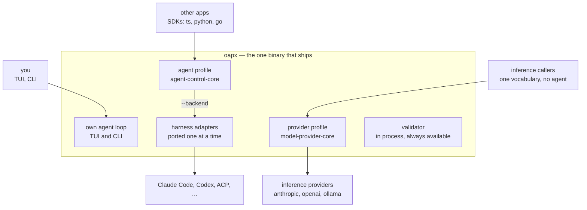

# Decision 0019: One Binary, And The Rewrite That Gets There

Status: proposed
Date: 2026-09-18
Protocol: `open-agent-protocol` version `0.1`
Profiles: `open-agent-protocol.agent-control-core` and
`open-agent-protocol.model-provider-core`
Amends: nothing. It decides what ships, what the Go tree becomes, and the order
and gates of the port that gets there
Gated by: [Decision 0018](0018-makai-becomes-first-party.md)

## Context

[Decision 0018](0018-makai-becomes-first-party.md) makes Makai the OAP SDK. It
now implements both profiles natively, and the work that record named is
finished: strict payload decoding, the tier-1 credential channel end to end and
tools and reasoning forwarded so a caller can ask for every part kind
(`lsm/makai#341`), and the carry round trip and specimen emission
(`lsm/makai#347`). Both are on that repository's `main` as of this date.

The adjudication record in [the provider draft](../drafts/model-provider-core.md)
described three of those as open until this change, which is this project's most
frequent defect shape — prose left behind by machinery — appearing in the
document whose job is to be the record of where the gaps are. It is corrected
alongside this record rather than after it.

That leaves two trees in two languages on opposite sides of one boundary. This
repository is the specification, the validator, a corpus, and eight adapters
that translate third-party harnesses **into** OAP. Makai is an implementation
that speaks OAP natively, and already carries the TUI, the agent loop, both
profiles and their bindings.

A user should install one thing and type one command. An earlier version of this
record proposed reaching that with two executables and declined a rewrite,
arguing from effort. That argument was weak, and this record replaces it.

## Decisions

### `oapx` is Makai renamed, and the port lands inside it

This is not a new codebase. The binary that ships is the implementation
[Decision 0018](0018-makai-becomes-first-party.md) made the OAP SDK, renamed,
and the port moves what this repository has into it rather than rebuilding both
halves.

That is the record's most useful property and it is worth stating before the
stages: **there is never a moment without a working product.** The TUI, the
agent loop, both profiles and their bindings already run. Each stage adds a
capability to a binary that already ships, which is why the port has no big
bang, no cutover, and no branch that has to be right all at once before anything
works.

It also decides what does *not* port. `client/` is a Go SDK and stays one.
`tools/nocomment` retires with the Go tree. `conformance/` is a development
harness and moves only if someone wants it in the product. Whether `serve/`
survives at all is an open question below. **What ports is what the product
needs**: the validator, the adapter interfaces and reference adapter, and the
adapters people actually use.

### One binary ships, and it is `oapx`



The two profiles are independent doors and neither is downstream of the other.
`oapx serve provider` serves a caller that wants one vocabulary over many
inference vendors and no agent loop at all.

**The name is `oapx`, and the Go binary keeps `oap` until it retires.** A
rename at the end costs nothing; a collision during the port costs the gate this
record depends on. Differential execution needs both implementations installed
and runnable side by side, and two executables cannot both be `oap` on one
`PATH`. So the new one is `oapx` from its first commit, `oap` stays what it is
today, and whether `oapx` inherits the shorter name once the Go tree retires is
a question for the day that happens.

**The validator ships inside it**, which is a capability rather than a
convenience. `oapx validate` needs no second install, an endpoint can check its
own emitted trace at runtime, and the split between a tool that validates and a
binary that serves disappears.

```
oapx                                 the TUI
oapx run "fix the failing test"      one shot, same loop, no server
oapx serve agent                     agent-control-core
oapx serve provider                  model-provider-core
oapx serve agent provider            both profiles, one process — --addr only
oapx serve agent --backend claude    a harness behind the same door
oapx validate <trace.json>           the validator, either profile
oapx check                           schemas, fixtures, reference adapter
oapx conformance --command "..."     drive an endpoint, assemble, validate
oapx specimens                       one of every envelope it emits

  serve flags:  --stdio | --addr host:port   --backend <name>   --config <path>
```

A role is a noun, so it is an argument rather than a flag. `--backend` carries a
value, and **its absence means the binary's own loop** — the property that makes
the name work without explanation.

Rejected: `oapx serve --agent` as a boolean, an option pretending to be a noun.
`oapx agent` at top level, which collides with `oapx run` in the reader's head.
`oapx serve endpoint` for the provider role, because `endpoint` already names the
*agent*-role binary in this repository, the destination member on a descriptor,
and the implementation serving a profile — three senses before a fourth.

### The Go tree becomes the oracle, not the product

It is not deleted when the port starts and it is not shipped. It is the
implementation the Zig one is diffed against.

A corpus proves what someone wrote a fixture for. Differential execution proves
what nobody thought of: run both implementations over the same input and compare
diagnostics. That has a natural end — when the Zig validator matches on all 546
fixtures **and** on fuzzed input until the fuzzer stops finding disagreements,
the Go implementation has no information left to give. Deleting it before that
turns a verifiable port into a hopeful one.

### Byte equality is not the whole gate

The corpus adjudicates **outputs**, and a port of this size is not mainly a
logic problem. The documented top defect class in the implementation doing the
porting is an `errdefer` left armed after ownership transfers — six instances on
the `model-provider-core` branch alone. A reducer with a double free or a leak
produces byte-identical `expected-oap.json` right up until it does not, and
every output gate in this record is blind to it.

So each stage gate carries a second clause: **allocation-failure testing over
every allocating function, and the corpus run under a leak-checking allocator**,
not byte equality alone. Cheap now, very expensive to retrofit across eight
adapters.

### Every stage is gated on data that already exists

The port does not need the Go tests. It needs the Go *fixtures*, which are
language-neutral:

- **546 manifest fixtures**, each with the exact `(valid, phase, codes)` the
  validator must produce.
- **108 adapter corpus cases** — `native.jsonl` through the production reducer,
  compared against `expected-oap.json`.

A Zig reducer either reproduces those bytes or it does not. That answers the
question a rewrite usually cannot answer — how do you know the new one is
faithful — for everything observable in a frame, and nothing else. What it does
not answer is the clause above.

**The seam differential execution needs already exists.** `oap validate
[--provider] --format=json <trace>` emits `(phase, code, pointer, expected,
actual)` per diagnostic as data, on arbitrary input rather than only on the
corpus. Comparing two implementations costs a diff of two JSON documents, so the
groundwork stage other ports need is free here.

### The schema is embedded and interpreted, not compiled into code

The Go validator compiles `schema/v0.1/*.json` with a JSON Schema 2020-12
library. Zig has no mature one, and this is the port's only genuine unknown.

**The schema bytes are embedded in the binary and interpreted at runtime** by a
bounded 2020-12 subset interpreter covering what these twelve files use.

An earlier version of this record chose code generation, and the argument
against it is that it buys nothing. A generator has to understand 2020-12
exactly as much as an interpreter does — it moves where that understanding runs
and adds two artifacts, the emitted validator and the gate that proves it still
matches its source. The interpreter is the one thing; codegen is that same thing
plus a generator plus generated code in review.

The deciding property is stronger than the arithmetic. **An embedded schema is
normative by construction**: the bytes in the binary *are* the schema. Under
codegen the binary's behaviour is a derivative and "the schema is still the
truth" becomes a claim some job checks — which is the same inversion this record
refuses one rung up.

The cost is a parse at process start and dynamic dispatch instead of
straight-line code: microseconds against milliseconds of I/O, amortised per
process when a test harness validates repeatedly. Codegen is reserved for a
profile that shows it matters.

Hand-writing the checks remains refused. It makes the Zig source the truth and
the schema a description of it.

### Order: validator first, adapters after

1. Types and strict decode. Makai has most of this already, and one piece of it
   wrong in a load-bearing place: its agent-control decoder reads the error code
   through a required enum, so a code outside its own eleven is a *decode
   failure* rather than an unknown value — at two call sites, one of which is
   `error.response`, the frame the open question below builds its proposed
   answer on. Built on unchanged, the Zig validator rejects this repository's own
   agent-control fixtures before any semantic check runs. The field is an owned
   string; an enum survives only as a mapping for what an implementation itself
   emits.
2. Schema validation, embedded and interpreted. Gate: all 546 fixtures match
   phase and codes.
3. The semantic state machine. Same gate, now including every diagnostic code.
4. Adapters, one at a time. Gate: the corpus reproduces `expected-oap.json`,
   under a leak-checking allocator.
5. The oracle is retired, or kept in CI.

**Differential fuzzing is not a stage.** It starts the moment stage 2 compiles
and runs continuously from there. A stage can slip; a gate that runs on every
change cannot. The argument for it is the one this record already makes against
the corpus — fixtures prove what someone wrote a fixture for — and that argument
applies to stages 2 and 3 as much as to the end of the port.

**The order is not arbitrary.** `adapter/adaptertest` runs the real validator
in-process on every trace an adapter emits, and that loop is the reason adapter
bugs surface at the unit-test boundary rather than in a trace weeks later.
Porting adapters first gives that up for the length of the port. Porting the
validator first means every adapter lands with the check already under it.

Adapters port by demand rather than by list. An unported adapter is unavailable
rather than broken, and `--backend hermes` says so.

### The oracle is not retired while any adapter is unported

Differential execution falling silent is the condition for retiring the
**validator** oracle. It says nothing about adapters.

The corpus carries a graduated unit's evidence across the port only for an
adapter that has been ported and reproduces it. For one still in Go, the
artifact its graduation rests on **is** the Go adapter. Retiring the tree on a
validator-shaped condition alone would delete the evidence base for every
unported adapter while its unit still claims graduation.

So retirement takes a second clause: every adapter whose unit claims graduation
is ported and reproduces its corpus, or that unit's graduation is explicitly
recorded as lapsed. There is no third option where the evidence quietly stops
existing.

**`adapter/makai` is the one exception, and this record takes it.** Decision
0018 describes the freeze — keeping the pinned corpus as the historical record
of what `+control-tools` graduated on — and then leaves the disposition to the
project owner rather than taking it. So the exception cannot be cited to that
record, and is decided here: `adapter/makai` is frozen, never ported, and its
unit does not lapse under the clause above. Its corpus is retained with the
frozen adapter; retiring the Go tree does not mean deleting it.

### A change that rewrites the corpus happens before the port or after it

Every stage in this record is gated on reproducing bytes that already exist.
That works because the bytes hold still.

Some changes under consideration rewrite the expectations themselves — moving
harness-specific error codes out of `code` and into `extensions` would
regenerate `expected-oap.json` across the adapter corpora. During the port, such
a change is diffed against a target that is also moving, and the two artifacts
that could catch an error in it, the oracle and the corpus, are both being
edited by the change that needs them.

So a corpus-rewriting change is made **entirely before the port or entirely
after it, never during**. Before, the Go tree performs the migration and the
corpus is regenerated once under an oracle that already has differential
coverage, and the port then aims at something that has stopped moving. After,
the port completes against today's expectations and the migration is a separate
change with two implementations available to diff. This is a property of the
corpus rather than of any particular change, and it binds whatever the error-code
question is answered with.

### The repositories merge with history

`git subtree` or a merge of unrelated histories, never a copy.

Both trees carry zero comments by policy, so every rationale lives in a commit
message. A flat copy destroys the only record of why the implementation is
shaped the way it is — which is the precise failure the comment policy's own
merge rule already anticipates for code arriving from another unit.

### Where everything lands

```
open-agent-protocol/
  README.md  STABILITY.md  IMPLEMENTERS.md  CLAUDE.md
  decisions/            protocol decisions
  drafts/               profiles and bindings
  schema/v0.1/          normative schemas — embedded into oapx
  fixtures/             the corpus: agent-control, provider, adapter corpora
  research/             mapping ledgers, adjudication record
  examples/

  zig/                  oapx — the binary that ships
    build.zig  build.zig.zon
    src/
      agent/ tui/ providers/ transports/ tools/ auth/ oauth/ json/
      protocol/{oap,agent,provider,tool,auth}
      validation/       ← ported from go/validation
      adapters/         ← ported from go/adapter, by demand
    test/  vendor/

  sdk/                  clients, one per language
    go/ python/ rust/ typescript/

  go/                   the oracle — deleted when differential goes silent
    protocol/ validation/ adapter/ serve/ client/ cmd/oap/ conformance/
    provider/ internal/ tools/nocomment/

  scripts/              comment checker, pattern gates
  docs/
```

**The specification sits at the root because it outlives both
implementations.** `schema/`, `fixtures/`, `drafts/` and `decisions/` belong to
neither tree, which is this record's rule about corpus ownership expressed as a
directory rather than as a sentence.

**`go/` means the oracle and nothing else.** The implementation moves from the
repository root into it, which costs an import-path rewrite across roughly 215
files. That is one scripted commit on a tree whose only remaining job is to be
diffed, and it makes `zig/` visibly the product from the first day rather than
the last. Makai's own Go SDK lands at `sdk/go` instead, so the name `go/` does
not mean two things while one of them is being deleted.

Three collisions the merge resolves rather than discovers:

**Two TypeScript clients.** This repository has `clients/ts`, the zero-dependency
far-side proof of the daemon wire; the implementation has `typescript/`. Whether
they become one `sdk/typescript` depends on whether the second speaks OAP or its
own surface, which is a question to settle by reading it.

**Two Go trees with different jobs**, resolved by the `sdk/go` placement above.

**Two comment checkers.** `tools/nocomment` covers `.go`; the implementation's
checker covers `.zig` and `.ts` and has retired its allowlist. The second must
cover `.go` **before** the first retires, or the policy has a gap for the length
of the port.

### A rewritten wrapper does not weaken the evidence

What makes an adapter third-party evidence under
[Decision 0015](0015-evidence-from-implementations-we-do-not-control.md) is that
the *harness* is outside this project and does not bend to it. The language of
our wrapper is not part of that test.

**Seven of the eight, not eight.** `adapter/makai` wraps the implementation
Decision 0018 makes first-party, so it stopped being third-party evidence before
this record and is frozen rather than ported. The seven that remain wrap
genuinely external projects and are unaffected by the language their wrapper is
written in.

So a graduated unit keeps its standing across the port, on one condition already
built: the ported adapter reproduces its corpus. The corpus is what carries the
evidence across the rewrite, which is a second job it was not designed for and
does anyway.

### Who builds and who checks stay different people

Through the port, the implementation and the expectations are not written by the
same side. Makai writes Zig; this repository holds the fixtures, the oracle and
the review.

This is not process for its own sake. Hours before this record, in `#84` on the
same day, the corpus in this repository shipped two positive fixtures encoding a
sequence gap as valid, because they were run before their expectations were written and the
validator that ran them encoded the same misreading. One artifact checking
itself agrees with itself. The separation is what caught it, and a rewrite is
the moment it matters most.

## Evidence

**The corpus has caught defects in both trees within a day of existing.** Run
against a real implementation, the fixture
`provider-grant-granting-and-refusing-at-once`
(`fixtures/provider/schema-invalid/`) was the one disagreement of that run: the
implementation decoded it cleanly, because its coherence rule checked `accepted`
against `credential_ref` in both directions and against `error` in neither, so a
response could grant and refuse at once and a refusal could carry no reason.
Reviewed against the draft, two fixtures of this repository's own —
`provider-sequence-gap` and the positive traces they were derived from — blessed
a sequence gap the draft forbids. Neither tree found its own defect. Both are closed
and both are citable: the implementation's coherence rule now checks `accepted`
against `error` in both directions as well as against `credential_ref`
(`lsm/makai#347`), and the sequence rule the gap fixtures needed was implemented
here rather than worked around by renumbering them (`#84`).

**The adapters are the best-shaped part of the port**, not the worst: eight
independent units of 2,670 to 3,540 lines each, each with a hermetic corpus and
a mapping ledger in `research/` that does not move. They are two thirds of the
work and the only part that can be done in any order.

**The comment policy already survives the merge.** The implementation tree
carries a checker over every tracked `.zig` and `.ts`, with self-tests and its
allowlist ratchet retired. The merged tree inherits enforcement and needs the
checker extended to `.go`, which is the cheap direction. `tools/nocomment`
retires with the Go tree.

**The measured shape**, counting non-test Go throughout. About 48,000 lines of
source, of which roughly 35,000 port: 24,545 in the eight adapters, 9,151 in
validation, 1,731 in the adapter interfaces and reference adapter. The hub in
`serve/` (5,564) is a separate question this record does not answer. `client/`,
`conformance/`, `provider/` and `tools/` are development artifacts that do not
ship. `adapter/adaptertest` (598) is a test kit the Zig side rebuilds rather
than ports, so it is not in the 35,000.

## Consequences

A user installs one binary and types one command, and the validator is part of
the product rather than a second download.

The rewrite re-derives every decision against a second implementation. That is
the argument for doing it beyond distribution: this project's entire defect
history is things found by building rather than by reading, and a port is that
exercise at full scale.

`adapter/makai/` is retired as Decision 0018 already anticipated — not needed
once Makai speaks OAP natively, not third-party evidence once Makai is
first-party, and frozen as the historical record of what `+control-tools`
graduated on.

`clients/ts` is unaffected. It is a client of the wire and its conformance claim
becomes "passes the corpus", which is now an artifact rather than a promise.

## What this decision does not admit

Deleting the Go tree when the port begins. It is the oracle until differential
execution stops producing disagreements, and its retirement is a separate call
with a stated condition.

Hand-written schema checks in Zig. The schema stays normative and the code is
derived from it.

A merge by copying. History is the rationale record in a tree with no comments.

The same side writing both the Zig implementation and the fixtures it is judged
against.

## Open questions

**Whether `serve/` survives.** The hub is twelve ops, an adapter dimension,
cursor replay and multiplexed subscriptions — a different layer from `oapx serve
agent`, which exposes one loop. Whether it ports, moves, or is dropped is not
decided here. Note what the layout above makes of each answer: if it does not
port it never appears under `zig/`, and it disappears with `go/` rather than
being removed. That makes the question a deletion rather than a port, which is
cheaper to decide and worth deciding early.

**What `oapx serve agent provider` routes on, and what answers a frame with no
profile.** This was filed as untested and is worse than that: it contradicts
what is built. Each of the implementation's two endpoints refuses the other's
profile **at decode**, and the refusal names which profile that endpoint serves.

**On `--stdio` the question is already answered, by a rule this record failed
to cite.** [The stdio binding](../drafts/provider-stdio.md) requires a binary
serving both profiles to serve them on **separate spawns, not interleaved on one
pipe**, because the profiles have disjoint envelope sets and separate scope
domains and one stream carrying both would oblige every consumer to implement
both to route anything. That is this question's own objection, made earlier and
better. This record conforms to the rule rather than amending it: `oapx serve
agent provider --stdio` is refused, each spawn's profile is fixed by the
arguments that started it, and no frame on that pipe is unattributable.

So the router is an `--addr` question only — one socket, two profiles, and a
frame to place before decode. It needs a router that reads the envelope's
`profile` before decode and hands the frame to the endpoint that owns it, and
the hard case is a frame whose `profile` is absent or unknown.

**The answer this record proposes: an `error.response` carrying
`invalid_request`, correlated where an id can be recovered, connection kept
open — and it costs one schema addition, named below.** For its own decision to
confirm.

Three answers here have been wrong, including this record's own first attempt,
and all three are kept because the reasons are worth more than the conclusion.

The one this record got wrong was that `error.response` sits in a base envelope
rather than in either profile, so answering with it needed no vocabulary the
frame had failed to declare. **There is no base envelope.** `error.response` is
defined in `envelope.schema.json`, which is titled the agent-control-core
envelope and pins `profile` to `open-agent-protocol.agent-control-core` with a
`const`. `provider-envelope.schema.json` enumerates nineteen types and
`error.response` is not among them; provider errors travel on
`inference.failed` and on the `error` member of a response payload. Both
schemas *require* `profile`, so every answer frame declares one, and answering
an unattributable frame with today's `error.response` emits a frame in a profile
the caller may never have been speaking — which is the hazard the sentence
claimed to avoid, restated as a fix for itself.

What survives the correction is the severity argument below, which is the part
doing the work. What it needs is a frame both endpoints can parse, and the
cheapest is **`model-provider-core` admitting `error.response`**: one type added
to the provider envelope, carrying the `protocolError` payload the profiles
already share.

That addition has a cost outside the schema, and whoever takes the decision
should pay it deliberately. The binding rule cited above says the profiles have
**disjoint envelope sets**, and today they do: 43 types and 19, overlapping in
nothing. Admitting `error.response` makes the overlap exactly one, and that
sentence stops being literally true. The rule's *conclusion* survives — one
shared error frame does not let a consumer implementing either profile route
the other's types, which is what the rule is actually protecting — but its
premise would need amending in the same change, not after it.

With the addition made, the answer is emitted in the profile the router routes
to, and the residual case is narrower than the question sounds — a connection that
has already carried one attributable frame has told the router which dialect it
speaks, so ambiguity survives only where a connection's *first* frame is
unattributable.

For that residue this record invents nothing. The router has no information, and
either profile is a guess the caller can half the time not decode — but a guess
that arrives is not worse than the silence it replaces, and a default is cheaper
than a third, profile-neutral envelope whose only member would be an error.
Which default, and whether the addition is made at all, is what this leaves
open.

The first of the two older wrong answers was that the profiles carry *disjoint*
error sets, so no code could answer for both. That was inherited from an implementation's own notes and
repeated without checking. What the specifications actually say is stranger:
**`agent-control-core` enumerates no error codes at all.** `ProtocolError.code`
is an open string in `common.schema.json`, and 47 distinct codes appear across
this repository's own agent-control fixtures — counting the adapter corpora's
`expected-oap.json`, which is where the harness-specific ones such as
`claude_api_429` live, and which is the scope that matters here because those
corpora are the traces the adapters actually emit. The three top-level fixture
directories alone hold 15. Only the provider profile closed its set, in `#82`,
earlier on the day of this record. So there is no intersection to appeal to and no missing
vocabulary either — there is one closed set and one open string.

The second was to close the connection. That is the wrong severity and it breaks
a rule this profile argues for elsewhere. A provider connection carries accepted
inferences, each owed exactly one terminal; closing on an unattributable frame
strands every one of them, which is the failure the profile refuses when it
declines to hand back an `inference_id` with a refusal. It is also not one
severity: on `--addr` it costs a connection, and on `--stdio` there is one
connection per process, so it means exit. Closing is for framing desync, where
the next frame boundary genuinely cannot be located. A frame that framed,
parsed, and had an envelope shape is a content error on a healthy stream, and a
healthy stream can carry its own answer.

Correlation is solved and has precedent: an implementation that cannot decode a
bad frame already sniffs the `id` out of the raw line so the refusal goes back
correlated. An unattributable frame takes the same treatment.

**What `agent-control-core` does about its error codes.** The provider profile
closed its set, and the reason applies here unchanged: a code table in prose
over an open string makes the action a caller derives a convention rather than a
contract. But those 47 codes are real traffic, and the two ends of the range say
why: `com.example.storage.object_not_found` comes from a hand-written fixture
and `claude_api_429` from an adapter corpus, which says the field is carrying two things — what a caller should **do**,
and where the error came **from**. Three shapes are available and this record
decides none of them.

*Close the set and send origin detail in `extensions`.* This is the resolution
the provider profile already made in prose — "an implementation that wants them
as distinct codes is free to say so in `extensions`" — so it keeps one
`ProtocolError` shape across both profiles. It is also the largest migration:
every harness-specific code in every adapter moves.

*Keep `code` open and add a closed member for the action class.* The contract
becomes the action, a harness keeps its own identifier, and nobody enumerates a
48th string. The provider profile **refuses** an `action` member today,
deliberately and with a schema test, because for a closed set the action derives
from the code and a wire member would be a second source of truth that can
disagree. For an open set that derivation is impossible, so the argument
inverts.

It also has an answer rather than only an inversion, and the answer is this
project's usual move: **a second source of truth that can be checked is not the
hazard an unchecked one is.** Admit `action` in the common shape, require it
where derivation is impossible, permit it where derivation works, and have the
validator assert there that it equals the derived value. One `ProtocolError`
shape instead of two, and the provider's redundancy becomes a diagnostic the
corpus can exercise rather than a divergence nobody sees. The cost is one more
rule, and `common.schema.json` is `additionalProperties: false`, so the member is
admitted for both profiles either way.

*Leave it open.* Status quo. The action stays a convention, and `retriable` —
which the base schema already carries and the provider profile treats as derived
rather than primary — stays the only machine-readable hint.

The port has to model one of the three, so this needs deciding before stage 1
finishes rather than after.

**How much larger the Zig tree is.** Thirty-five thousand lines of Go is not
thirty-five thousand lines of Zig. Explicit allocators and `errdefer` inflate
it. This changes the estimate and not the decision.
